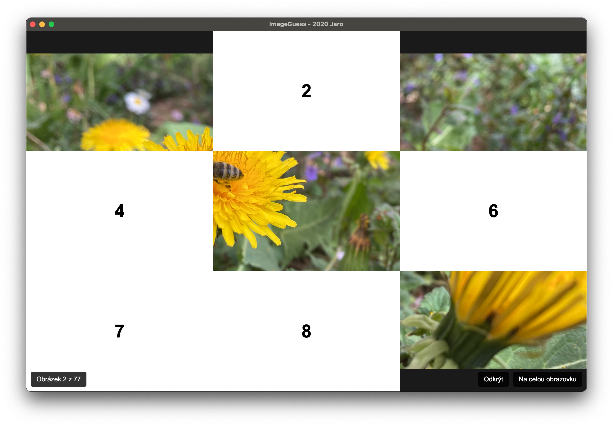

# ImageGuess

A fun and challenging image guessing game where players try to identify what's hidden behind numbered tiles. Click on the numbered overlay buttons to reveal parts of the image underneath and guess what it is!



## Features

- **Interactive gameplay**: Click numbered tiles to reveal parts of the hidden image
- **Clean interface**: Simple and intuitive design focused on the guessing experience
- **Cross-platform**: Available for macOS, Windows, and Linux

## Download

Download the latest release from the [Releases page](https://github.com/DrabekDigital/imageguess/releases):

- **macOS**: `.dmg` file
- **Windows**: `.exe` portable executable
- **Linux**: `.AppImage` file

## Running on Linux

On Linux you will need to install FUSE 2, this might be under `fuse` or `libfuse2t64`... 

Additionally you might need the `zlib1g-dev` package:

```bash
sudo apt install zlib1g-dev
```

If you encounter with `The SUID sandbox helper binary was found, but is not configured correctly. Rather than run without sandboxing I'm aborting now.` rerun with `--no-sandbox`